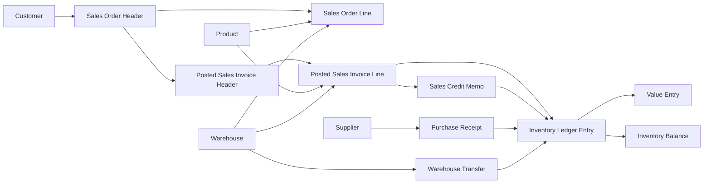

# EOIP NordWerk Domain & ERP Source Model v1.0

**Work package:** EOIP-02  
**Canonical model:** `data/eoip/domain-model.yaml`  
**Depends on:** EOIP Requirements & Scope Specification v1.0

## Purpose

This specification defines the operational source world from which EOIP analytical data will later be engineered.

The core design rule is simple:

> The source must look like an ERP system, not like a dashboard dataset.

EOIP therefore starts from master data, business documents and quantity/value ledgers. Star-schema facts, dimensions and KPIs will be created later in the transformation and dimensional-model work packages.

## Domain overview

## Why quantity and value are separated

A central architectural choice is the separation between:

- physical inventory movement: `inventory_ledger_entry`
- inventory/sales valuation: `value_entry`

This gives EOIP a more realistic ERP lineage.

For example, gross profit is not generated as an arbitrary source column. Posted sales value comes from commercial documents/value movements while actual cost is traced through value entries associated with physical inventory movements.

That gives the later analytical model a credible answer to:

> Where did this margin number come from?

## Main business flows

### Order to cash

Sales Order → Sales Order Line → Posted Sales Invoice → Inventory Sale Movement → Value Entry

Open order quantities remain visible before invoicing, which is important for the later stockout-risk business case.

### Return to credit

Original Invoice → Credit Memo → optional physical return → value reversal

Not every return automatically increases stock. A return may be restocked, scrapped or purely financial.

### Receive to stock

Supplier → Purchase Receipt → positive inventory ledger movement → cost value entry

Purchase receipts exist because inventory cannot realistically appear from nowhere. Full procurement and supplier performance analytics remain outside EOIP and belong to ProcureGuard.

### Warehouse transfer

Transfer document → negative movement at source warehouse → positive movement at destination warehouse

Both movements must reconcile.

## Scope discipline

The operational model deliberately contains enough context to support EOIP without prematurely building later projects.

It does **not** introduce:

- purchase-price variance logic
- supplier scorecards
- contract leakage
- cost-to-serve
- contribution margin after freight/handling
- ABC/XYZ
- safety stock
- reorder optimization

Those analytical responsibilities remain with ProcureGuard, MarginGuard and InventoryIQ.

## Source grains

The exact grain, key, required attributes and relationships for each source entity are maintained in the canonical YAML model.

Important examples:

- Customer: one row per customer
- Product: one row per product
- Sales Order Line: one row per order line
- Sales Invoice Line: one row per posted invoice line
- Inventory Ledger Entry: one row per posted physical stock movement
- Value Entry: one row per posted value movement associated with inventory activity
- Inventory Balance: one current state row per product × warehouse

## Expected scale

EOIP uses 36 months of synthetic history.

The generator will create hundreds of thousands of commercial document lines and approximately one million or more inventory/value ledger records. Ranges rather than one exact row count are specified because realism is more important than an artificial exact target.

Annual sales must be calibrated against the shared NordWerk company profile instead of copying the company revenue value into another source-of-truth file.

## KPI coverage

EOIP-02 includes a machine-readable mapping from every frozen EOIP V1 KPI ID to the operational source entities required to calculate it.

This is an important quality gate:

> If a KPI has no credible operational source lineage, the source model is incomplete.

The same rule applies to all three EOIP business cases.

## Data quality

The source model must support reconciliation across:

- document headers and lines
- invoice quantities and inventory movements
- returns and original invoices
- transfer-out and transfer-in movements
- inventory balance and cumulative ledger movement
- sales value and actual cost

The synthetic generator in EOIP-03 must emit validation results proving these rules.

## Handoff to EOIP-03

EOIP-03 may start when this model is accepted.

The data generator must then implement the model rather than inventing new entities ad hoc. Any material source-model expansion after this point becomes a scope change and must be evaluated against the portfolio baseline.
